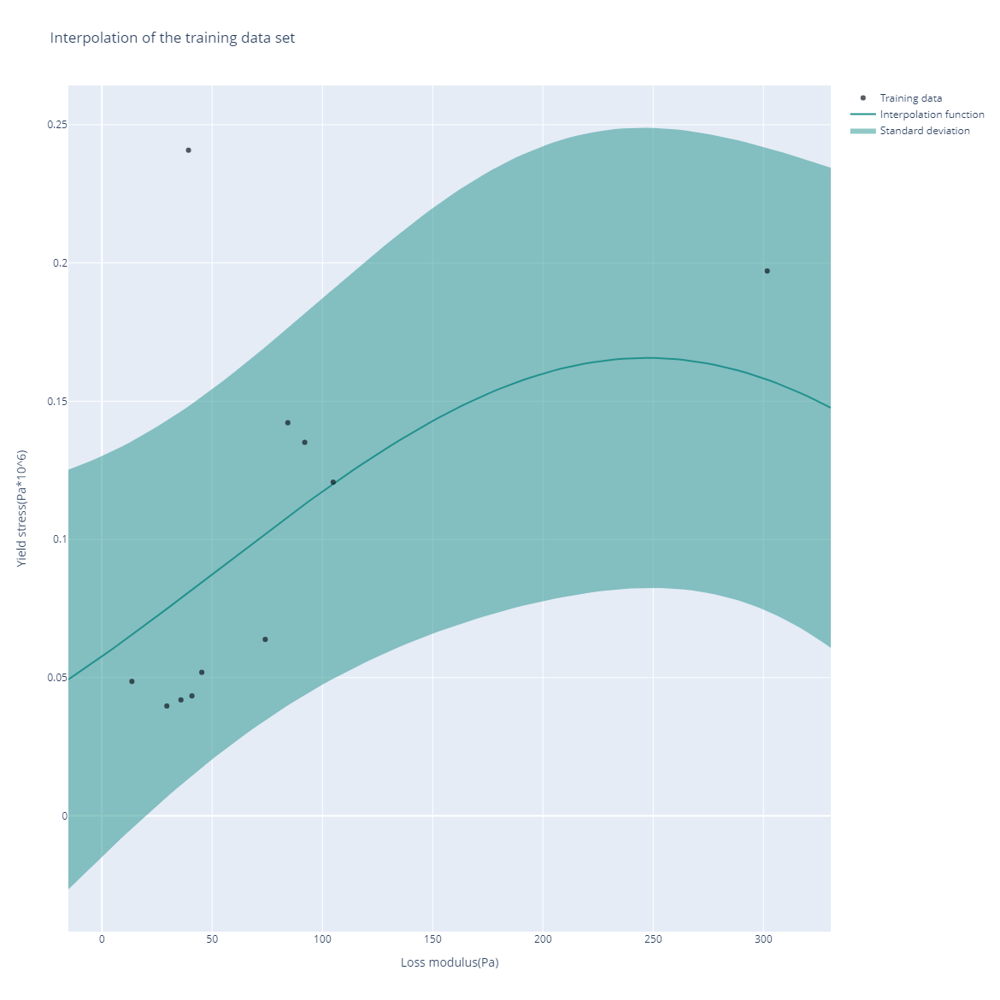
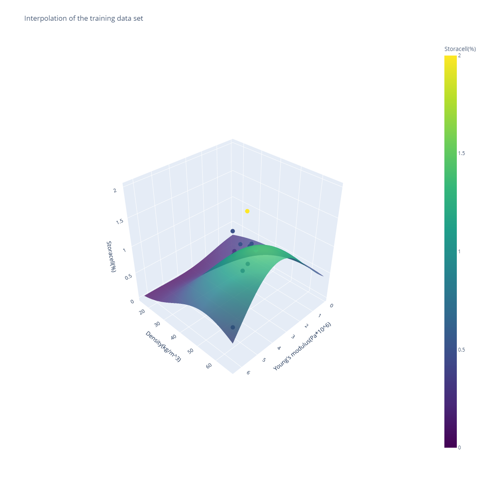

[](https://foamwoodproject.com/)

# GPR prediction program (scientific)

A program for predicting rheological and strength properties of FoamWood utilizing Gaussian Process Regression (GPR).

<figure>
  
  <figcaption>FoamWood can be used as a material in various products.</figcaption>
</figure>

<figure>
  
  <figcaption>Image of a 2D interpolation plot that the program outputs.</figcaption>
</figure>

<figure>
  
  <figcaption>Image of a 3D interpolation plot that the program outputs.</figcaption>
</figure>

# Requirements

1. Python
    - I used version 3.9.12 but others will probably work as well

2. All the packages listed in the beginning of
    - main_program.py
    - additional_methods.py
    - data_methods.py

The packages can be installed with pip for example.

# Example 1 (simple)

1. Navigate to the folder that you just downloaded from GitHub with the command
```
cd FILL-THIS-IN-YOURSELF\GPR-prediction-program-scientific-main
```

2. Launch the program with the command
```
python main_program.py
```

# Example 2 (advanced)

The program has various additional arguments that are listed here:

- --input
- --output
- --optimize-length-scales-automatically
- --length-scales
- --input-values
- --test-size
- --seed

1. [very useful] Input

```
python main_program.py --input Min` grad` angle`(rad/C`) --input Benecel`(%`)
```

Note: Special characters such as whitespaces and parentheses need to have the escape character '\`' in front of them. If you are using Linux bash instead of PowerShell, the escape character is '\\' instead of '\`'.

You can add everything from 1 to 3 different inputs to the program. The predictions printed in the terminal as well as the figures in the "figures" -folder will all change depending on which input variables you choose to use for your prediction.

2. [very useful] Output

```
python main_program.py --output Yield` stress`(Pa*10^6`)
```

You can only have 1 output variable when running the program. This is the variable being predicted.

3. [technical] Optimize length scales automatically

```
python main_program.py --optimize-length-scales-automatically
```

This will turn on the built-in optimizer and determine length scales based on that. I don't recommend turning this setting on (it is off by default). It is however there as an option for those who want to try it out.

If you're unsure, don't use this argument and stick with the default settings of the program.

4. [technical] Length scales

```
python main_program.py --length-scales 10 --length-scales 0.1
```

The length scale values control the behaviour of the [RBF kernel](https://scikit-learn.org/stable/modules/generated/sklearn.gaussian_process.kernels.RBF.html) in the [GPR model](https://scikit-learn.org/stable/modules/generated/sklearn.gaussian_process.GaussianProcessRegressor.html). The length scale values have to always be larger than zero. Each length scale value corresponds to one input variable, and thus you should include either no arguments of this type (in which case they are inferred using a pretty good heuristic that is NOT the bad optimizer mentioned earlier), or alternatively the same number of arguments as the number of input variables.

If you're unsure, don't use this argument and stick with the default settings of the program.

5. [useful] Input values

```
python main_program.py --input-values -0.037 --input-values 761.21
```

What if you want to know the predicted value of one specific point? Even though the figures give a good general picture of what's going on, you might want to know the predicted value of one specific point. Naturally here as well you have to have the same number of arguments as the number of input variables.

```
---Specific point view---
Input value of Min grad angle(rad/C): -0.037
Input value of Storage modulus at min grad angle(Pa): 761.21
Output value of Yield stress(Pa*10^6): 0.156
-----------END-----------
```

Note: The printed text in your terminal might differ from this if the dataset used has been altered since the making of this guide.

6. [technical] Test size

```
python main_program.py --test-size 0.4
```

You might want to alter the ratio to which the training and validation set size are split to. The default for this is 0.1 (training set is 90% and validation set is 10%), but a larger validation set size might sometimes be desired especially when more data is gathered over time.

7. [technical] Seed

```
python main_program.py --seed 7
```

The seed argument is used to make the program deterministic. In short, by using the same seed you will always get the same result no matter how many times you run the program. The seed 0 is used by default.

# Analysis

The error of the GPR model is printed in the terminal:

```
---Model error---
Relative training error: 35.249%
Relative validation error: 37.295%
-------END-------
```

PCA is also performed on the data. Figures can be found in the "figures" -folder.

# How to add more data to the model

## DMTA data (rheology)

1. Add your data files to the "data" -folder

2. Parse your data files in data_methods.py

```
data = [
    pd.read_table('{}Rh_DMTA_000Storacell15Benecel_1Hz.txt'.format(path_1), decimal=',', comment='#', encoding='utf-16'),
    pd.read_table('{}Rh_DMTA_025Storacell15Benecel_1Hz.txt'.format(path_1), decimal=',', comment='#', encoding='utf-16'),
    # ...
    # PARSE YOUR DATA FILES HERE
]
```

## Compression test data

1. Hard code the compression test data to data_methods.py

```
yield_stress = [
    0.03973, 0.05190,
    # ...
    # ADD YOUR DATA HERE
]
yield_strain = [
    6.540, 6.274,
    # ...
    # ADD YOUR DATA HERE
]
youngs_modulus = [
    0.607, 1.098,
    # ...
    # ADD YOUR DATA HERE
]

conc_storacell = [
    0.00, 0.25,
    # ...
    # ADD YOUR DATA HERE
]
conc_benecel = [
    1.50, 1.50,
    # ...
    # ADD YOUR DATA HERE
]
lab_density = [
    20.11, 24.70,
    # ...
    # ADD YOUR DATA HERE
]
```

Note: Make sure that the new data is inserted in the same order in both the "data" -variable (DMTA data) as well as the "yield_stress", "yield_strain", ..., "lab_density" -variables (compression test data).

Note: If you have lots of data (too much to hard code) you can of course also just add the compression test data files to the "data" -folder and then instead of hard coding the data parse the data.

# How to add more variables to the model

As in the "Compression test data" -subsection, you can complete step 1 either by hard coding individual numbers or by parsing data files. We will be parsing data files in this example.

1. Add your data files to the "data" -folder

2. Parse your data files in data_methods.py

```
yield_stress = [
    0.03973, 0.05190,
    # ...
]
yield_strain = [
    6.540, 6.274,
    # ...
]
# ...
# ADD YOUR NEW VARIABLE HERE:
# new_variable = parsing_program(path)
```

Note: Make sure the new variable has the same amount of elements as all the other data variables. Your new variable should for example have the same number of elements as the "data" -variable.

3. Add the name of your variable to the "columns" -variable

```
columns = [
    'Min grad angle(rad/C)',
    'Storage modulus at min grad angle(Pa)',
    # ...
    # 'NAME OF NEW VARIABLE'
]
```

4. Add your new data variable to the return value of the "load_data" -method

```
return [min_grad_angle, storage_modulus_at_min_grad_angle, ..., new_variable], columns
```
